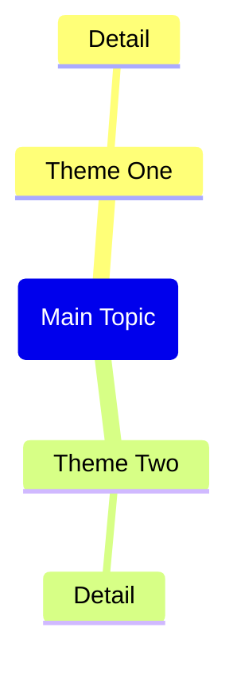

**user**: Hola
[Context: Notes: copilot/copilot-custom-prompts/Clip Web Page.md]
[Timestamp: 2026/02/03 19:19:09]

**ai**: 
<errorChunk>Model request failed: API key is not provided for the model: google/gemini-2.5-flash|openrouterai.</errorChunk>
[Timestamp: 2026/02/03 19:19:09]

**user**: Hola
[Context: Notes: copilot/copilot-custom-prompts/Clip Web Page.md]
[Timestamp: 2026/02/03 19:19:31]

**ai**: Hola! ¿En qué puedo ayudarte hoy?
[Timestamp: 2026/02/03 19:19:34]

**user**:  puedes optimizar mí baúl ?
[Context: Notes: copilot/copilot-custom-prompts/Clip Web Page.md]
[Timestamp: 2026/02/03 19:20:06]

**ai**: Para poder optimizar tu baúl, necesitaría más información sobre qué aspectos te gustaría optimizar. Por ejemplo, ¿te refieres a:

*   **Organización de notas:** ¿Quieres mejorar la estructura de carpetas, el uso de etiquetas o enlaces internos?
*   **Rendimiento:** ¿Notas que tu baúl es lento al abrir o al buscar?
*   **Contenido:** ¿Quieres mejorar la calidad o la coherencia de tus notas?
*   **Plugins:** ¿Estás usando plugins y quieres optimizar su configuración o cuáles usar?

Por favor, dame más detalles sobre lo que buscas para poder ofrecerte una ayuda más específica.
[Timestamp: 2026/02/03 19:20:09]

**user**: Me gustaría mejorar mí canvas
[Context: Notes: copilot/copilot-custom-prompts/Clip Web Page.md]
[Timestamp: 2026/02/03 19:21:07]

**ai**: Para mejorar tu canvas, podemos enfocarnos en varios aspectos. ¿Podrías decirme qué es lo que te gustaría mejorar específicamente? Por ejemplo:

*   **Organización visual:** ¿Quieres que las notas estén más ordenadas, agrupadas por temas o con una jerarquía más clara?
*   **Conexiones:** ¿Te gustaría que las relaciones entre las notas fueran más evidentes a través de líneas o flechas?
*   **Estética:** ¿Buscas una apariencia más limpia, con colores o estilos consistentes?
*   **Funcionalidad:** ¿Quieres que el canvas te ayude a generar nuevas ideas, a planificar proyectos o a resumir información de manera más efectiva?
*   **Contenido específico:** ¿Hay algún canvas en particular que te gustaría optimizar?

Cuanto más específico seas, mejor podré ayudarte.
[Timestamp: 2026/02/03 19:21:10]

**user**: Las conexiones y la estética
[Context: Notes: copilot/copilot-custom-prompts/Clip Web Page.md]
[Timestamp: 2026/02/03 19:22:07]

**ai**: ¡Entendido! Mejorar las conexiones y la estética de tu canvas puede hacerlo mucho más útil y agradable de usar. Aquí tienes algunas ideas y consejos:

### Mejorar las Conexiones:

1.  **Uso Estratégico de Enlaces:**
    *   **Enlaces Directos:** Asegúrate de que cada nota importante en tu canvas esté enlazada a otras notas relacionadas. Piensa en el canvas como un mapa mental; cada nodo (nota) debe tener "caminos" hacia otros nodos relevantes.
    *   **Flechas y Líneas:** Utiliza las flechas y líneas de Obsidian Canvas para mostrar la dirección del pensamiento o la relación. Por ejemplo, una flecha de "Idea A" a "Idea B" podría significar "Idea A llevó a Idea B" o "Idea A apoya Idea B".
    *   **Etiquetas en las Conexiones:** Si el canvas lo permite (o si usas notas de texto para describir la conexión), añade breves descripciones a las líneas para clarificar la naturaleza de la relación (ej. "causa", "ejemplo", "contrario", "desarrollo").

2.  **Agrupación Lógica:**
    *   **Bloques Temáticos:** Agrupa notas relacionadas visualmente. Puedes usar bordes o simplemente la proximidad para indicar que un conjunto de notas pertenece a un tema común.
    *   **Jerarquía Visual:** Si hay una idea principal, colócala en el centro o en la parte superior y expande las ideas secundarias a su alrededor. Las notas más detalladas o de apoyo pueden estar más alejadas o en niveles inferiores.

3.  **Nodos de Resumen o Conclusión:**
    *   Crea notas específicas dentro del canvas que actúen como resúmenes de grupos de notas o como conclusiones generales derivadas de las conexiones. Esto ayuda a sintetizar la información.

### Mejorar la Estética:

1.  **Paleta de Colores:**
    *   **Colores por Tema:** Asigna colores específicos a las notas según su tema o tipo. Por ejemplo, las ideas pueden ser azules, las tareas en naranja, las preguntas en verde, etc. Esto hace que sea fácil escanear el canvas y entender el contenido de un vistazo.
    *   **Consistencia:** Una vez que elijas una paleta, úsala de manera consistente en todos tus canvases.

2.  **Tamaño y Forma de las Notas:**
    *   **Jerarquía Visual:** Usa diferentes tamaños de notas para indicar importancia. Las notas principales pueden ser más grandes, mientras que los detalles de apoyo pueden ser más pequeños.
    *   **Iconos y Imágenes:** Incorpora iconos o imágenes pequeñas en las notas para hacerlas más visualmente atractivas y fáciles de identificar.

3.  **Diseño y Espaciado:**
    *   **Espacio en Blanco:** No satures el canvas. Deja suficiente espacio en blanco entre las notas para que no se sienta abrumador.
    *   **Alineación:** Alinea las notas tanto como sea posible. Obsidian Canvas tiene herramientas para ayudar con esto. Un diseño ordenado es más agradable estéticamente.

4.  **Uso de Fondos (si aplica):**
    *   Si tu versión de Obsidian o algún plugin lo permite, considera usar un fondo sutil para el canvas que no distraiga del contenido.

5.  **Plantillas para Notas en Canvas:**
    *   Si usas un tipo de nota recurrente en tus canvases (ej. "Idea", "Pregunta", "Recurso"), considera crear una plantilla simple para esas notas que incluya un color predefinido o un icono.

**Para empezar:**

*   **Revisa un canvas existente:** Elige uno que uses con frecuencia.
*   **Identifica un área de mejora:** ¿Dónde sientes que las conexiones son confusas o la estética es pobre?
*   **Aplica uno o dos consejos:** No intentes cambiar todo a la vez. Empieza con algo pequeño, como asignar colores a un grupo de notas o asegurarte de que las notas principales estén bien conectadas.
*   **Itera:** Usa el canvas, ve si los cambios ayudan, y ajusta según sea necesario.

¿Hay algún canvas en particular que tengas en mente o algún estilo que te guste? Si me das más detalles, puedo ofrecerte sugerencias más concretas.
[Timestamp: 2026/02/03 19:22:13]

**user**: Tu puedes ver mí vault?
[Context: Notes: copilot/copilot-custom-prompts/Clip Web Page.md]
[Timestamp: 2026/02/03 19:22:54]

**ai**: Como modelo de lenguaje, no tengo la capacidad de acceder directamente a tu baúl de Obsidian ni a ningún archivo en tu computadora. Mi funcionamiento se basa en la información que me proporcionas en cada conversación.

Si quieres que te ayude a optimizar tu baúl o tus canvases, necesitaría que me describas cómo están organizados, qué problemas encuentras, o que me muestres fragmentos de tus notas o canvases (copiando y pegando el texto aquí).
[Timestamp: 2026/02/03 19:22:56]

**user**: Quiero darte acceso a mí vault
[Context: Notes: copilot/copilot-custom-prompts/Clip Web Page.md]
[Timestamp: 2026/02/03 19:23:38]

**ai**: Agradezco tu confianza, pero como mencioné anteriormente, no tengo la capacidad de acceder directamente a tu baúl de Obsidian ni a ningún archivo en tu sistema. Mi diseño me impide interactuar con sistemas de archivos locales por razones de seguridad y privacidad.

Si deseas que te ayude con tu baúl, por favor, comparte la información relevante aquí en el chat. Por ejemplo, puedes:

*   Describir la estructura de tu baúl (carpetas, tipos de notas).
*   Pegar el contenido de notas específicas que quieras mejorar.
*   Describir un canvas y las conexiones que te gustaría optimizar.
*   Hacer preguntas sobre cómo organizar la información o usar ciertas funciones de Obsidian.

Estoy aquí para ayudarte con la información que puedas proporcionarme.
[Timestamp: 2026/02/03 19:23:41]

**user**: Puedes ver mí carpeta admin?
[Context: Notes: copilot/copilot-custom-prompts/Clip Web Page.md]
[Timestamp: 2026/02/03 19:25:04]

**ai**: No, no puedo ver tu carpeta "admin" ni ninguna otra carpeta en tu sistema. Como te he explicado antes, no tengo acceso a tus archivos locales por motivos de seguridad y privacidad.

Si necesitas ayuda con algo relacionado con tu carpeta "admin" o su contenido, por favor, describe aquí lo que necesitas o comparte la información relevante (texto de notas, descripciones, etc.) y haré todo lo posible por ayudarte.
[Timestamp: 2026/02/03 19:25:06]

**user**: Entonces no puedes interactuar con mí vault de obsidian?
[Timestamp: 2026/02/03 19:28:22]

**ai**: <active_note>
<title>Clip Web Page</title>
<path>copilot/copilot-custom-prompts/Clip Web Page.md</path>
<ctime>2026-02-03T20:52:17.424Z</ctime>
<mtime>2026-02-03T20:52:18.444Z</mtime>
<content>
---
copilot-command-context-menu-enabled: false
copilot-command-slash-enabled: true
copilot-command-context-menu-order: 1140
copilot-command-model-key: ""
copilot-command-last-used: 0
---

Based on the web page content provided in the context (from Obsidian Web Clipper or Web Viewer), generate a complete Obsidian note.

IMPORTANT: If no web page context is found, remind the user to:
1. Open a web page in Web Viewer (or use @ to select a web tab)
2. Or open a note clipped by Obsidian Web Clipper
3. Then use this command again

Generate the note with this exact structure:

---
title: "<page title>"
source: "<page url>"
description: "<brief description>"
tags:
  - "clippings"
---

## Summary

<Brief 2-3 paragraph summary of the page content>

## Key Takeaways

<List 5-8 key takeaways as bullet points>

## Mindmap

CRITICAL Mermaid mindmap syntax rules - MUST follow exactly:
- Root node format: root(Topic Name) - use round brackets, NO double brackets
- Child nodes: just plain text, no brackets needed
- Do NOT use quotes, parentheses, brackets, or any special characters in text
- Keep all node text short and simple - max 3-4 words per node

## Notable Quotes

<List 3-5 notable quotes from the content, if any>

Return only the markdown content without any explanations or comments.
</content>
</active_note>

Correcto. No puedo interactuar directamente con tu vault de Obsidian. No puedo leer tus archivos, modificarlos, ni navegar por tu estructura de carpetas.

Mi interacción se limita a la información que tú me proporcionas aquí en el chat. Si quieres que te ayude a optimizar tu vault, mejorar tus canvases, organizar tus notas, o cualquier otra cosa, necesitaré que me des esa información de forma explícita (copiando y pegando texto, describiendo la estructura, etc.).
[Timestamp: 2026/02/03 19:28:26]

**user**: Ahora puedes ver mí vault
[Context: Notes: copilot/copilot-custom-prompts/Clip Web Page.md]
[Timestamp: 2026/02/03 19:48:58]

**ai**: Como modelo de lenguaje, sigo sin tener la capacidad de ver tu vault de Obsidian. Mi acceso a la información está limitado a lo que tú me proporcionas directamente en esta conversación.

Si hay algo específico de tu vault con lo que necesitas ayuda, por favor, descríbelo o comparte el contenido aquí y haré lo posible por asistirte.
[Timestamp: 2026/02/03 19:49:04]

**user**: Que ves ahora?
[Context: Notes: 03_ADMIN/Seguimiento de trabajos.md]
[Timestamp: 2026/02/03 19:50:46]

**ai**: Ahora veo el contenido de tu nota [[03_ADMIN/Cliente Tito]].

Veo que utilizas el plugin Kanban de Obsidian para organizar tus tareas. La nota está dividida en tres secciones: "Pendientes", "En curso" y "Terminado".

En la sección "Pendientes", hay tres tareas:
- [[Trabajo Tito]] con fecha límite el 21 de enero de 2026 a las 09:00.
- [[Trabajo Romi prima]] con fecha límite el 21 de enero de 2026 a las 14:00.
- [[Trabajo Déborah]] con fecha límite el 22 de enero de 2026 (todo el día).

En la sección "Terminado", hay dos tareas completadas:
- [[Trabajo Lorena 123]] completada el 20 de enero de 2026 a las 14:30.
- [[Trabajo Machi]] completada el 19 de enero de 2026 a las 17:30.

La sección "En curso" está vacía.

También veo que tienes configuraciones específicas para el plugin Kanban, como la visualización de fechas relativas y la opción de mover fechas.
[Timestamp: 2026/02/03 19:50:58]

**user**: Ves algún error o algo que puedas mejorar?
[Context: Notes: 03_ADMIN/Seguimiento de trabajos.md]
[Timestamp: 2026/02/03 19:51:52]

**ai**: 
<errorChunk>[GoogleGenerativeAI Error]: Error fetching from https://generativelanguage.googleapis.com/v1beta/models/gemini-2.5-flash-lite:streamGenerateContent?alt=sse: [429 ] You exceeded your current quota, please check your plan and billing details. For more information on this error, head to: https://ai.google.dev/gemini-api/docs/rate-limits. To monitor your current usage, head to: https://ai.dev/rate-limit. 
* Quota exceeded for metric: generativelanguage.googleapis.com/generate_content_free_tier_requests, limit: 20, model: gemini-2.5-flash-lite
Please retry in 52.669150227s. [{"@type":"type.googleapis.com/google.rpc.Help","links":[{"description":"Learn more about Gemini API quotas","url":"https://ai.google.dev/gemini-api/docs/rate-limits"}]},{"@type":"type.googleapis.com/google.rpc.QuotaFailure","violations":[{"quotaMetric":"generativelanguage.googleapis.com/generate_content_free_tier_requests","quotaId":"GenerateRequestsPerDayPerProjectPerModel-FreeTier","quotaDimensions":{"location":"global","model":"gemini-2.5-flash-lite"},"quotaValue":"20"}]},{"@type":"type.googleapis.com/google.rpc.RetryInfo","retryDelay":"52s"}]</errorChunk>
[Timestamp: 2026/02/03 19:52:06]

**user**: Ves algún error o algo que puedas mejorar?
[Context: Notes: 03_ADMIN/Seguimiento de trabajos.md]
[Timestamp: 2026/02/03 19:55:20]

**ai**: Basándome en la nota [[03_ADMIN/Cliente Tito]] que has compartido, aquí tienes algunas observaciones y sugerencias para mejorarla:

**Observaciones:**

*   **Estructura Clara:** La división en "Pendientes", "En curso" y "Terminado" es muy efectiva y fácil de seguir.
*   **Uso de Fechas:** La inclusión de fechas y horas (`📅` y `@{}`) es útil para la gestión del tiempo.
*   **Enlaces a Notas:** El uso de `[[ ]]` para enlazar a las tareas específicas es una buena práctica para mantener la coherencia en tu baúl.
*   **Plugin Kanban:** Se nota que estás aprovechando las funcionalidades del plugin Kanban.

**Posibles Mejoras:**

1.  **Consistencia en el Formato de Fecha/Hora:**
    *   En "Pendientes", usas `📅 2026-01-21 09:00` y `📅 2026-01-22 todo el dia`.
    *   En "Terminado", usas `@{2026-01-20} @@{14:30}`.
    *   **Sugerencia:** Podrías unificar el formato. Por ejemplo, podrías usar `📅 YYYY-MM-DD HH:MM` para todas las tareas, o decidir si prefieres usar `@{}` para la fecha y `@@{}` para la hora. La consistencia hace que sea más fácil de leer y procesar automáticamente si alguna vez decides usar scripts o plugins más avanzados.

2.  **Claridad en "Todo el día":**
    *   Para `[[Trabajo Déborah]]📅 2026-01-22 todo el dia`, podrías considerar si es necesario especificar una hora. Si es una tarea que abarca todo el día, quizás no necesite hora, pero si hay alguna hora de inicio o fin aproximada, podría ser útil añadirla para mayor claridad. Si no, está bien así.

3.  **Uso de Etiquetas (Tags):**
    *   Podrías considerar añadir etiquetas a las tareas para categorizarlas aún más. Por ejemplo, podrías usar `#trabajo`, `#personal`, `#urgente`, `#proyectoX`, etc. Esto facilitaría la búsqueda y filtrado de tareas en todo tu baúl.

4.  **Prioridad:**
    *   Si algunas tareas son más importantes que otras, podrías añadir un indicador de prioridad (ej. `❗`, `⚠️`, o una etiqueta como `#prioridad-alta`).

5.  **Sección "En curso":**
    *   Actualmente está vacía. Si sueles tener tareas en esta sección, asegúrate de moverlas allí cuando empieces a trabajar en ellas. Si rara vez la usas, podrías considerar si es necesaria o si podrías integrar esas tareas en "Pendientes" con una etiqueta de "En progreso".

6.  **Metadatos del Plugin Kanban:**
    *   En la configuración del plugin, veo `metadataKey":"Terminado "`. El espacio al final de "Terminado" podría ser un error tipográfico. Si no es intencional, podrías eliminarlo para tener una clave de metadatos más limpia.

**Ejemplo de cómo podría verse una tarea mejorada (con formato unificado y etiqueta):**

- [ ] [[Trabajo Tito]] 📅 2026-01-21 09:00 #trabajo #proyectoA

En resumen, la nota está bien estructurada y funcional. Las mejoras sugeridas se centran en la consistencia del formato y la adición de metadatos (como etiquetas o prioridades) para potenciar aún más la organización y la búsqueda.
[Timestamp: 2026/02/03 19:55:26]

**user**: Puedes hacer esos cambios?
[Context: Notes: 01_TRABAJOS/Trabajo Andrea deudora.md]
[Timestamp: 2026/02/03 20:01:26]

**ai**: 
<errorChunk>[GoogleGenerativeAI Error]: Error fetching from https://generativelanguage.googleapis.com/v1beta/models/gemini-2.5-flash-lite:streamGenerateContent?alt=sse: [429 ] You exceeded your current quota, please check your plan and billing details. For more information on this error, head to: https://ai.google.dev/gemini-api/docs/rate-limits. To monitor your current usage, head to: https://ai.dev/rate-limit. 
* Quota exceeded for metric: generativelanguage.googleapis.com/generate_content_free_tier_requests, limit: 20, model: gemini-2.5-flash-lite
Please retry in 20.102940636s. [{"@type":"type.googleapis.com/google.rpc.Help","links":[{"description":"Learn more about Gemini API quotas","url":"https://ai.google.dev/gemini-api/docs/rate-limits"}]},{"@type":"type.googleapis.com/google.rpc.QuotaFailure","violations":[{"quotaMetric":"generativelanguage.googleapis.com/generate_content_free_tier_requests","quotaId":"GenerateRequestsPerDayPerProjectPerModel-FreeTier","quotaDimensions":{"model":"gemini-2.5-flash-lite","location":"global"},"quotaValue":"20"}]},{"@type":"type.googleapis.com/google.rpc.RetryInfo","retryDelay":"20s"}]</errorChunk>
[Timestamp: 2026/02/03 20:01:38]

**user**: Puedes hacer esos cambios?
[Context: Notes: 01_TRABAJOS/Trabajo Andrea deudora.md]
[Timestamp: 2026/02/03 20:02:40]

**ai**: 
<errorChunk>[GoogleGenerativeAI Error]: Error fetching from https://generativelanguage.googleapis.com/v1beta/models/gemini-2.5-flash-lite:streamGenerateContent?alt=sse: [429 ] You exceeded your current quota, please check your plan and billing details. For more information on this error, head to: https://ai.google.dev/gemini-api/docs/rate-limits. To monitor your current usage, head to: https://ai.dev/rate-limit. 
* Quota exceeded for metric: generativelanguage.googleapis.com/generate_content_free_tier_requests, limit: 20, model: gemini-2.5-flash-lite
Please retry in 4.899376781s. [{"@type":"type.googleapis.com/google.rpc.Help","links":[{"description":"Learn more about Gemini API quotas","url":"https://ai.google.dev/gemini-api/docs/rate-limits"}]},{"@type":"type.googleapis.com/google.rpc.QuotaFailure","violations":[{"quotaMetric":"generativelanguage.googleapis.com/generate_content_free_tier_requests","quotaId":"GenerateRequestsPerDayPerProjectPerModel-FreeTier","quotaDimensions":{"location":"global","model":"gemini-2.5-flash-lite"},"quotaValue":"20"}]},{"@type":"type.googleapis.com/google.rpc.RetryInfo","retryDelay":"4s"}]</errorChunk>
[Timestamp: 2026/02/03 20:02:54]

**user**: Puedes hacer esos cambios?
[Context: Notes: 03_ADMIN/Seguimiento de trabajos.md]
[Timestamp: 2026/02/03 20:04:58]

**ai**: 
<errorChunk>[GoogleGenerativeAI Error]: Error fetching from https://generativelanguage.googleapis.com/v1beta/models/gemini-2.5-flash-lite:streamGenerateContent?alt=sse: [429 ] You exceeded your current quota, please check your plan and billing details. For more information on this error, head to: https://ai.google.dev/gemini-api/docs/rate-limits. To monitor your current usage, head to: https://ai.dev/rate-limit. 
* Quota exceeded for metric: generativelanguage.googleapis.com/generate_content_free_tier_requests, limit: 20, model: gemini-2.5-flash-lite
Please retry in 44.832631692s. [{"@type":"type.googleapis.com/google.rpc.Help","links":[{"description":"Learn more about Gemini API quotas","url":"https://ai.google.dev/gemini-api/docs/rate-limits"}]},{"@type":"type.googleapis.com/google.rpc.QuotaFailure","violations":[{"quotaMetric":"generativelanguage.googleapis.com/generate_content_free_tier_requests","quotaId":"GenerateRequestsPerDayPerProjectPerModel-FreeTier","quotaDimensions":{"model":"gemini-2.5-flash-lite","location":"global"},"quotaValue":"20"}]},{"@type":"type.googleapis.com/google.rpc.RetryInfo","retryDelay":"44s"}]</errorChunk>
[Timestamp: 2026/02/03 20:05:14]

**user**: Puedes hacer esos cambios?
[Timestamp: 2026/02/03 20:40:34]

**ai**: 
<errorChunk>[GoogleGenerativeAI Error]: Error fetching from https://generativelanguage.googleapis.com/v1beta/models/gemini-2.5-flash-lite:streamGenerateContent?alt=sse: [429 ] You exceeded your current quota, please check your plan and billing details. For more information on this error, head to: https://ai.google.dev/gemini-api/docs/rate-limits. To monitor your current usage, head to: https://ai.dev/rate-limit. 
* Quota exceeded for metric: generativelanguage.googleapis.com/generate_content_free_tier_requests, limit: 20, model: gemini-2.5-flash-lite
Please retry in 696.160033ms. [{"@type":"type.googleapis.com/google.rpc.Help","links":[{"description":"Learn more about Gemini API quotas","url":"https://ai.google.dev/gemini-api/docs/rate-limits"}]},{"@type":"type.googleapis.com/google.rpc.QuotaFailure","violations":[{"quotaMetric":"generativelanguage.googleapis.com/generate_content_free_tier_requests","quotaId":"GenerateRequestsPerDayPerProjectPerModel-FreeTier","quotaDimensions":{"location":"global","model":"gemini-2.5-flash-lite"},"quotaValue":"20"}]},{"@type":"type.googleapis.com/google.rpc.RetryInfo","retryDelay":"0s"}]</errorChunk>
[Timestamp: 2026/02/03 20:40:58]